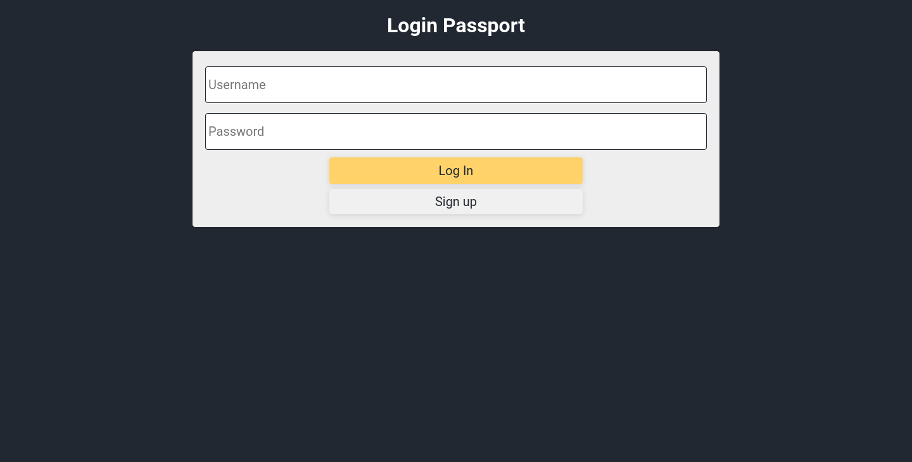

# Login passport

An example of login using passport.

**Note**: The password of the app saves without using something like [bcrypt](https://www.npmjs.com/package/bcrypt).

Screenshot

## How to run
1. Clone the repo
2. Run `npm i`
3. Create a `.env` file and add `PORT` and `MONGO_URI` variables
4. Run `npm run start`